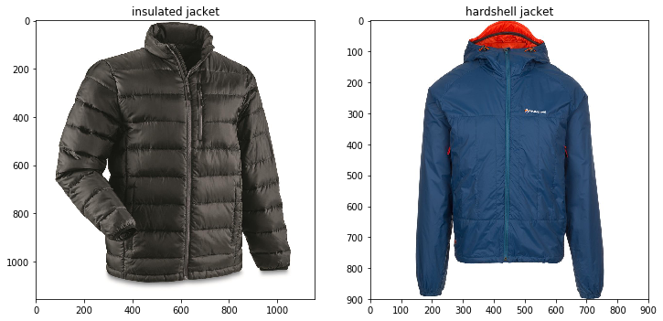

```python
from azure.cognitiveservices.vision.customvision.training import CustomVisionTrainingClient
from azure.cognitiveservices.vision.customvision.training.models import ImageUrlCreateEntry

ENDPOINT = "https://southcentralus.api.cognitive.microsoft.com"

# Replace with a valid key
training_key = "25ca911e348247f7b3e5d061d8bcc7e9"
prediction_key = "ba017c67fbcd41f19a945ab30e016d3a"

trainer = CustomVisionTrainingClient(training_key, endpoint=ENDPOINT)

# Create a new project
print ("Creating project...")
project = trainer.create_project("JacketClassifier")
```

    Creating project...


```python
hardshell_jacket_tag = trainer.create_tag(project.id, "hardshell jacket")
insulated_jacket_tag = trainer.create_tag(project.id, "insulated jacket")
```


```python
#trainer.create_images_from_files()
import os 
root = r'/data/home/team15/notebooks'

hardshell_dir = r'resize_images/hardshell_jackets'
insulated_dir = r'resize_images/insulated_jackets'
for img1 in os.listdir(os.path.join(root,hardshell_dir)):
    img1 = os.path.join(root,hardshell_dir,img1)
    with open(img1,'rb') as f:
        trainer.create_images_from_data(project.id, f.read(),[hardshell_jacket_tag.id])

```


```python
#trainer.create_images_from_files()
for img1 in os.listdir(os.path.join(root,insulated_dir)):
    img1 = os.path.join(root,insulated_dir,img1)
    with open(img1,'rb') as f:
        trainer.create_images_from_data(project.id, f.read(),[insulated_jacket_tag.id])
```


```python
import time

print ("Training...")
#trainer.get_project(project.id)
iteration = trainer.train_project(project.id)
while (iteration.status != "Completed"):
    iteration = trainer.get_iteration(project.id, iteration.id)
    print ("Training status: " + iteration.status)
    time.sleep(1)

# The iteration is now trained. Make it the default project endpoint
trainer.update_iteration(project.id, iteration.id, is_default=True)
print ("Done!")
```

    Training...


    ---------------------------------------------------------------------------

    HttpOperationError                        Traceback (most recent call last)

    <ipython-input-50-f05b2a0ed7a0> in <module>()
          3 print ("Training...")
          4 #trainer.get_project(project.id)
    ----> 5 iteration = trainer.train_project(project.id)
          6 while (iteration.status != "Completed"):
          7     iteration = trainer.get_iteration(project.id, iteration.id)


    /anaconda/envs/py35/lib/python3.5/site-packages/azure/cognitiveservices/vision/customvision/training/custom_vision_training_client.py in train_project(self, project_id, custom_headers, raw, **operation_config)
       2187 
       2188         if response.status_code not in [200]:
    -> 2189             raise HttpOperationError(self._deserialize, response)
       2190 
       2191         deserialized = None


    HttpOperationError: Operation returned an invalid status code 'Bad Request'


```python
import requests
import matplotlib.pyplot as plt
from PIL import Image

# Needed to display matplotlib plots in Jupyter
%matplotlib inline

from azure.cognitiveservices.vision.customvision.prediction import CustomVisionPredictionClient

# Now there is a trained endpoint that can be used to make a prediction

predictor = CustomVisionPredictionClient(prediction_key, endpoint=ENDPOINT)

test_img1 = "https://image.sportsmansguide.com/adimgs/l/6/673942i3_ts.jpg"
test_img2 = "http://content.backcountry.com/images/items/900/MNT/MNT0012/MORBLUOR.jpg"

results1 = predictor.predict_image_url(project.id, iteration.id, url=test_img1)
results2 = predictor.predict_image_url(project.id, iteration.id, url=test_img2)

# Display the results.
for prediction in results1.predictions:
    print ("\t" + prediction.tag_name + ": {0:.2f}%".format(prediction.probability * 100))
    
for prediction in results2.predictions:
    print ("\t" + prediction.tag_name + ": {0:.2f}%".format(prediction.probability * 100))   
    
    
# Create a figure to display the images
fig = plt.figure(figsize=(12, 16))
# Open it and add it to the figure (in a 4-row grid)
response = requests.get(test_img1, stream=True)
response.raw.decode_content=True
img1=Image.open(response.raw)

response = requests.get(test_img2, stream=True)
response.raw.decode_content=True
img2=Image.open(response.raw)

a=fig.add_subplot(1,2,1)
imgplot = plt.imshow(img1)
a.set_title(results1.predictions[0].tag_name)

b=fig.add_subplot(1,2,2)
imgplot = plt.imshow(img2)
b.set_title(results2.predictions[0].tag_name)

# Add the folder name (the class of the image)

```

    	insulated jacket: 100.00%
    	hardshell jacket: 0.00%
    	hardshell jacket: 20.74%
    	insulated jacket: 15.66%


    Text(0.5,1,'hardshell jacket')




