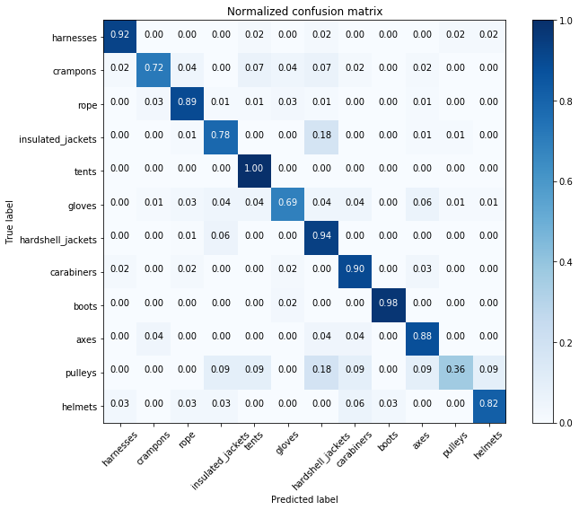

```python
import os
from skimage import io
from sklearn.datasets import load_sample_image
from sklearn import svm


```


```python
## PREPARE TRAINING SET
# Import datasets, classifiers and performance metrics
from sklearn import datasets, svm, metrics
from sklearn.linear_model import LogisticRegression
from sklearn.model_selection import train_test_split
import matplotlib.image as mpimg
import numpy as np 

myImgs = []
myTags = []
enumTags = []
imgdir = 'resize_images' # Folder containing extracted images
# loop recursively through the folders
dir_num = 0
file_count = 0

for root, folders, filenames in os.walk(imgdir):
    for folder in folders:
        enumTags.append(folder)
        for imgFile in os.listdir(os.path.join(root, folder)):
            # in each folder, get the first file
            filePath = os.path.join(root,folder,imgFile)
            imgSci = io.imread(filePath)
            myImgs.append(np.ravel(imgSci))
            myTags.append(dir_num)
            file_count = file_count + 1
        dir_num = dir_num + 1
        
print(enumTags)            
print(file_count)
newArr = np.array(myImgs)
newArrTags = np.array(myTags)

#Train with 1/3rd of the data
X_train, X_test, y_train, y_test = train_test_split(newArr, newArrTags, test_size=0.33, random_state=42)

print(newArr.size)
print(len(myTags))

# Create a classifier: a support vector classifier
classifier = LogisticRegression()
# We learn the digits on the first half of the digits
classifier.fit(X_train, y_train)


```

    ['harnesses', 'crampons', 'rope', 'insulated_jackets', 'tents', 'gloves', 'hardshell_jackets', 'carabiners', 'boots', 'axes', 'pulleys', 'helmets']
    2117
    104054784
    2117


    LogisticRegression(C=1.0, class_weight=None, dual=False, fit_intercept=True,
              intercept_scaling=1, max_iter=100, multi_class='ovr', n_jobs=1,
              penalty='l2', random_state=None, solver='liblinear', tol=0.0001,
              verbose=0, warm_start=False)


```python
print(type(newArr))
print(newArr.shape)
print(newArrTags)
print(newArrTags.shape)
print(X_train)
```


```python
# Now predict the value of the digit on the second half:
expected = y_test
predicted = classifier.predict(X_test)
```


```python
confusion_matrix = metrics.confusion_matrix(expected, predicted)
print("Classification report for classifier %s:\n%s\n"
       % (classifier, metrics.classification_report(expected, predicted)))
#print("Confusion matrix:\n%s" % confusion_matrix)
```

    Classification report for classifier LogisticRegression(C=1.0, class_weight=None, dual=False, fit_intercept=True,
              intercept_scaling=1, max_iter=100, multi_class='ovr', n_jobs=1,
              penalty='l2', random_state=None, solver='liblinear', tol=0.0001,
              verbose=0, warm_start=False):
                 precision    recall  f1-score   support
    
              0       0.92      0.92      0.92        52
              1       0.89      0.72      0.80        46
              2       0.88      0.89      0.89        76
              3       0.82      0.78      0.80        79
              4       0.80      1.00      0.89        35
              5       0.87      0.69      0.77        68
              6       0.84      0.94      0.89       141
              7       0.91      0.90      0.91        92
              8       0.98      0.98      0.98        41
              9       0.67      0.88      0.76        25
             10       0.57      0.36      0.44        11
             11       0.90      0.82      0.86        33
    
    avg / total       0.86      0.86      0.86       699
    
    


```python
import matplotlib.pyplot as plt
def plot_confusion_matrix(cm, classes,
                          normalize=False,
                          title='Confusion matrix',
                          cmap=plt.cm.Blues):
    """
    This function prints and plots the confusion matrix.
    Normalization can be applied by setting `normalize=True`.
    """
    if normalize:
        cm = cm.astype('float') / cm.sum(axis=1)[:, np.newaxis]
        print("Normalized confusion matrix")
    else:
        print('Confusion matrix, without normalization')

    #print(cm)

    plt.imshow(cm, interpolation='nearest', cmap=cmap)
    plt.title(title)
    plt.colorbar()
    tick_marks = np.arange(len(classes))
    plt.xticks(tick_marks, classes, rotation=45)
    plt.yticks(tick_marks, classes)

    fmt = '.2f' if normalize else 'd'
    thresh = cm.max() / 2.
    for i, j in itertools.product(range(cm.shape[0]), range(cm.shape[1])):
        plt.text(j, i, format(cm[i, j], fmt),
                 horizontalalignment="center",
                 color="white" if cm[i, j] > thresh else "black")

    plt.ylabel('True label')
    plt.xlabel('Predicted label')
    plt.tight_layout()

```


```python
import itertools
# Compute confusion matrix
#cnf_matrix = confusion_matrix(y_test, y_pred)
#np.set_printoptions(precision=2)

# Plot non-normalized confusion matrix
#plt.figure()
#plot_confusion_matrix(confusion_matrix, classes=enumTags, title='Confusion matrix, without normalization')

# Plot normalized confusion matrix
plt.figure(figsize=(10,8))
plot_confusion_matrix(confusion_matrix, classes=enumTags, normalize=True, title='Normalized confusion matrix')

plt.show()

```

    Normalized confusion matrix





```python
import os
import shutil
import numpy as np
import matplotlib.pyplot as plt
from PIL import Image

# Needed to display matplotlib plots in Jupyter
%matplotlib inline

imgdir = 'challenge3_test' # Folder containing images to check

# Create a figure to display the images
fig = plt.figure(figsize=(12, 16))

# loop recursively through the folders
dir_num = 0
for root, folders, filenames in os.walk(imgdir):
    for imgFile in filenames:
        # in each folder, get the first file
        filePath = os.path.join(root,imgFile)
        print(root)
        print(imgFile)
        print(filePath)
        # Open it and add it to the figure (in a 4-row grid)
        img = Image.open(filePath)
        a=fig.add_subplot(1,5,dir_num + 1)
        img.thumbnail((128,128))
        imgNew = Image.new("RGB", (128,128), "white")
        offsetX = int((128 - img.width)/2)
        offsetY = int((128 - img.height)/2)
        imgNew.paste(img, (offsetX, offsetY))
        imgplot = plt.imshow(imgNew)
        # Add the file name (the class of the image)
        #a.set_title(imgFile)
        imgSci = io.imread(filePath)
        imgData = np.array(np.ravel(imgSci)).reshape(1,-1)
        
        prediction = classifier.predict(imgData)
        predictionProb = classifier.predict_proba(imgData)
        a.set_title(enumTags[int(prediction)] + " (" + str(np.max(predictionProb))[0:4] + ")")
        print(np.max(predictionProb))

        dir_num = dir_num + 1
```

    challenge3_test
    10007284x1065726_zm.jpeg
    challenge3_test/10007284x1065726_zm.jpeg
    0.9999998040109708
    challenge3_test
    10116634x1038116_zm.jpeg
    challenge3_test/10116634x1038116_zm.jpeg
    0.9992160325976164
    challenge3_test
    10093342x1013403_zm.jpeg
    challenge3_test/10093342x1013403_zm.jpeg
    0.9942289892814012
    challenge3_test
    100172.jpeg
    challenge3_test/100172.jpeg
    0.7349173457587518
    challenge3_test
    100536.jpeg
    challenge3_test/100536.jpeg
    0.9779167730120929


