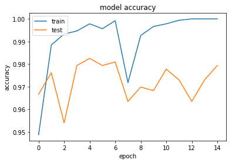

```python
import os
from keras.models import Sequential
from keras.layers import Conv2D
from keras.layers import MaxPooling2D
from keras.layers import Flatten
from keras.layers import Dense
from keras.preprocessing.image import ImageDataGenerator, load_img
import matplotlib.pyplot as plt
from PIL import Image
import numpy as np
from keras.applications.vgg16 import VGG16

# Needed to display matplotlib plots in Jupyter
%matplotlib inline
```


```python
classifier = Sequential()
classifier.add(Conv2D(32, (6, 6), strides=(3, 3), input_shape=(128,128,3)))  # add relu?
classifier.add(MaxPooling2D(pool_size=(2, 2)))
classifier.add(Conv2D(64, (6, 6), strides=(3, 3)))  # add relu?
classifier.add(MaxPooling2D(pool_size=(2, 2)))
classifier.add(Dense(32, activation='relu')) # add activation?
classifier.add(Flatten())
classifier.add(Dense(12, activation='softmax')) # add activation?
classifier.compile(optimizer='adam', loss='categorical_crossentropy', metrics=['accuracy'])
```


```python
full_datagen = ImageDataGenerator(rescale = 1./255,
                                  shear_range=0.2,
                                  zoom_range=0.2,
                                  horizontal_flip=True,
                                 validation_split=0.3)
```


```python
imgdir = 'resize_images' # Folder containing extracted images
training_set = full_datagen.flow_from_directory(imgdir, target_size=(128,128),
                                            batch_size=32,
                                            class_mode="categorical",
                                           subset='training')
test_set = full_datagen.flow_from_directory(imgdir, target_size=(128,128),
                                            batch_size=32,
                                            class_mode="categorical",
                                           subset='validation')
```

    Found 1487 images belonging to 12 classes.
    Found 630 images belonging to 12 classes.


```python
history = classifier.fit_generator(training_set, steps_per_epoch=160, epochs=15, validation_data=test_set, validation_steps=160)
```

    Epoch 1/15
    160/160 [==============================] - 19s 120ms/step - loss: 0.0835 - acc: 0.9761 - val_loss: 0.8084 - val_acc: 0.8698
    Epoch 2/15
    160/160 [==============================] - 18s 113ms/step - loss: 0.0743 - acc: 0.9784 - val_loss: 0.7359 - val_acc: 0.8889
    Epoch 3/15
    160/160 [==============================] - 18s 114ms/step - loss: 0.0206 - acc: 0.9928 - val_loss: 0.6114 - val_acc: 0.8937
    Epoch 4/15
    160/160 [==============================] - 18s 114ms/step - loss: 0.0278 - acc: 0.9896 - val_loss: 0.6114 - val_acc: 0.8952
    Epoch 5/15
    160/160 [==============================] - 18s 113ms/step - loss: 0.0343 - acc: 0.9892 - val_loss: 0.7255 - val_acc: 0.8937
    Epoch 6/15
    160/160 [==============================] - 18s 114ms/step - loss: 0.0399 - acc: 0.9879 - val_loss: 0.6607 - val_acc: 0.8968
    Epoch 7/15
    160/160 [==============================] - 18s 114ms/step - loss: 0.0244 - acc: 0.9902 - val_loss: 0.7467 - val_acc: 0.8952
    Epoch 8/15
    160/160 [==============================] - 18s 115ms/step - loss: 0.0123 - acc: 0.9961 - val_loss: 0.6569 - val_acc: 0.8968
    Epoch 9/15
    160/160 [==============================] - 18s 113ms/step - loss: 0.0678 - acc: 0.9775 - val_loss: 0.6468 - val_acc: 0.8873
    Epoch 10/15
    160/160 [==============================] - 18s 114ms/step - loss: 0.0388 - acc: 0.9871 - val_loss: 0.5528 - val_acc: 0.9063
    Epoch 11/15
    160/160 [==============================] - 18s 114ms/step - loss: 0.0298 - acc: 0.9898 - val_loss: 0.7189 - val_acc: 0.8794
    Epoch 12/15
    160/160 [==============================] - 18s 113ms/step - loss: 0.0353 - acc: 0.9886 - val_loss: 0.6078 - val_acc: 0.9127
    Epoch 13/15
    160/160 [==============================] - 18s 115ms/step - loss: 0.0264 - acc: 0.9908 - val_loss: 0.5820 - val_acc: 0.9000
    Epoch 14/15
    160/160 [==============================] - 18s 114ms/step - loss: 0.0421 - acc: 0.9874 - val_loss: 0.5413 - val_acc: 0.9048
    Epoch 15/15
    160/160 [==============================] - 18s 113ms/step - loss: 0.0296 - acc: 0.9914 - val_loss: 0.6087 - val_acc: 0.9048


```python
# list all data in history
print(history.history.keys())
# summarize history for accuracy
plt.plot(history.history['acc'])
plt.plot(history.history['val_acc'])
plt.title('model accuracy')
plt.ylabel('accuracy')
plt.xlabel('epoch')
plt.legend(['train', 'test'], loc='upper left')
plt.show()
# summarize history for loss
plt.plot(history.history['loss'])
plt.plot(history.history['val_loss'])
plt.title('model loss')
plt.ylabel('loss')
plt.xlabel('epoch')
plt.legend(['train', 'test'], loc='upper left')
plt.show()
```

    dict_keys(['val_acc', 'loss', 'val_loss', 'acc'])


```python
imgdir = 'challenge3_test' # Folder containing images to check
categories = training_set.class_indices
categories = {v: k for k, v in categories.items()}
# Create a figure to display the images
fig = plt.figure(figsize=(12, 16))

# loop recursively through the folders
dir_num = 0
for root, folders, filenames in os.walk(imgdir):
    for imgFile in filenames:
        # in each folder, get the first file
        a=fig.add_subplot(1,5,dir_num + 1)
        filePath = os.path.join(root,imgFile)
        # Open it and add it to the figure (in a 4-row grid)
        img = Image.open(filePath)
        imgplot = plt.imshow(img)
        # Add the file name (the class of the image)
        im = load_img(filePath)
        prediction = classifier.predict(np.reshape(im,[1,128,128,3]))
        a.set_title(categories[np.argmax(prediction)])
        dir_num = dir_num + 1
```


```python
vgg = VGG16(weights='imagenet', include_top=False, input_shape=(128,128,3))
print(vgg.summary())
```

    Downloading data from https://github.com/fchollet/deep-learning-models/releases/download/v0.1/vgg16_weights_tf_dim_ordering_tf_kernels_notop.h5
    58892288/58889256 [==============================] - 2s 0us/step
    _________________________________________________________________
    Layer (type)                 Output Shape              Param #   
    =================================================================
    input_3 (InputLayer)         (None, 128, 128, 3)       0         
    _________________________________________________________________
    block1_conv1 (Conv2D)        (None, 128, 128, 64)      1792      
    _________________________________________________________________
    block1_conv2 (Conv2D)        (None, 128, 128, 64)      36928     
    _________________________________________________________________
    block1_pool (MaxPooling2D)   (None, 64, 64, 64)        0         
    _________________________________________________________________
    block2_conv1 (Conv2D)        (None, 64, 64, 128)       73856     
    _________________________________________________________________
    block2_conv2 (Conv2D)        (None, 64, 64, 128)       147584    
    _________________________________________________________________
    block2_pool (MaxPooling2D)   (None, 32, 32, 128)       0         
    _________________________________________________________________
    block3_conv1 (Conv2D)        (None, 32, 32, 256)       295168    
    _________________________________________________________________
    block3_conv2 (Conv2D)        (None, 32, 32, 256)       590080    
    _________________________________________________________________
    block3_conv3 (Conv2D)        (None, 32, 32, 256)       590080    
    _________________________________________________________________
    block3_pool (MaxPooling2D)   (None, 16, 16, 256)       0         
    _________________________________________________________________
    block4_conv1 (Conv2D)        (None, 16, 16, 512)       1180160   
    _________________________________________________________________
    block4_conv2 (Conv2D)        (None, 16, 16, 512)       2359808   
    _________________________________________________________________
    block4_conv3 (Conv2D)        (None, 16, 16, 512)       2359808   
    _________________________________________________________________
    block4_pool (MaxPooling2D)   (None, 8, 8, 512)         0         
    _________________________________________________________________
    block5_conv1 (Conv2D)        (None, 8, 8, 512)         2359808   
    _________________________________________________________________
    block5_conv2 (Conv2D)        (None, 8, 8, 512)         2359808   
    _________________________________________________________________
    block5_conv3 (Conv2D)        (None, 8, 8, 512)         2359808   
    _________________________________________________________________
    block5_pool (MaxPooling2D)   (None, 4, 4, 512)         0         
    =================================================================
    Total params: 14,714,688
    Trainable params: 14,714,688
    Non-trainable params: 0
    _________________________________________________________________
    None


```python
print(classifier.summary())
```

    _________________________________________________________________
    Layer (type)                 Output Shape              Param #   
    =================================================================
    conv2d_11 (Conv2D)           (None, 41, 41, 32)        3488      
    _________________________________________________________________
    max_pooling2d_11 (MaxPooling (None, 20, 20, 32)        0         
    _________________________________________________________________
    conv2d_12 (Conv2D)           (None, 5, 5, 64)          73792     
    _________________________________________________________________
    max_pooling2d_12 (MaxPooling (None, 2, 2, 64)          0         
    _________________________________________________________________
    dense_6 (Dense)              (None, 2, 2, 32)          2080      
    _________________________________________________________________
    flatten_1 (Flatten)          (None, 128)               0         
    _________________________________________________________________
    dense_7 (Dense)              (None, 12)                1548      
    =================================================================
    Total params: 80,908
    Trainable params: 80,908
    Non-trainable params: 0
    _________________________________________________________________
    None


```python
for layer in vgg.layers[:-2]:
    layer.trainable = False
```


```python
model = Sequential()

back_end = Sequential()
back_end.add(Flatten())
back_end.add(Dense(12, activation='softmax')) # add activation?

model.add(vgg)
model.add(back_end)

model.compile(optimizer='adam', loss='categorical_crossentropy', metrics=['accuracy'])
```


```python
print(model.summary())
```

    _________________________________________________________________
    Layer (type)                 Output Shape              Param #   
    =================================================================
    vgg16 (Model)                (None, 4, 4, 512)         14714688  
    _________________________________________________________________
    sequential_16 (Sequential)   (None, 12)                98316     
    =================================================================
    Total params: 14,813,004
    Trainable params: 2,458,124
    Non-trainable params: 12,354,880
    _________________________________________________________________
    None


```python
history_tl = model.fit_generator(training_set, steps_per_epoch=160, epochs=15, validation_data=test_set, validation_steps=160)
```

    Epoch 1/15
    160/160 [==============================] - 24s 153ms/step - loss: 0.1596 - acc: 0.9486 - val_loss: 0.1015 - val_acc: 0.9667
    Epoch 2/15
    160/160 [==============================] - 20s 126ms/step - loss: 0.0305 - acc: 0.9887 - val_loss: 0.0764 - val_acc: 0.9762
    Epoch 3/15
    160/160 [==============================] - 20s 128ms/step - loss: 0.0223 - acc: 0.9934 - val_loss: 0.1578 - val_acc: 0.9540
    Epoch 4/15
    160/160 [==============================] - 20s 126ms/step - loss: 0.0202 - acc: 0.9947 - val_loss: 0.0728 - val_acc: 0.9794
    Epoch 5/15
    160/160 [==============================] - 20s 127ms/step - loss: 0.0053 - acc: 0.9979 - val_loss: 0.0746 - val_acc: 0.9825
    Epoch 6/15
    160/160 [==============================] - 20s 125ms/step - loss: 0.0149 - acc: 0.9957 - val_loss: 0.0973 - val_acc: 0.9794
    Epoch 7/15
    160/160 [==============================] - 20s 127ms/step - loss: 0.0019 - acc: 0.9992 - val_loss: 0.0844 - val_acc: 0.9810
    Epoch 8/15
    160/160 [==============================] - 20s 127ms/step - loss: 0.2040 - acc: 0.9718 - val_loss: 0.2226 - val_acc: 0.9635
    Epoch 9/15
    160/160 [==============================] - 20s 126ms/step - loss: 0.0384 - acc: 0.9926 - val_loss: 0.2234 - val_acc: 0.9698
    Epoch 10/15
    160/160 [==============================] - 20s 127ms/step - loss: 0.0129 - acc: 0.9967 - val_loss: 0.1225 - val_acc: 0.9683
    Epoch 11/15
    160/160 [==============================] - 20s 126ms/step - loss: 0.0079 - acc: 0.9976 - val_loss: 0.1069 - val_acc: 0.9778
    Epoch 12/15
    160/160 [==============================] - 20s 127ms/step - loss: 0.0017 - acc: 0.9994 - val_loss: 0.1314 - val_acc: 0.9730
    Epoch 13/15
    160/160 [==============================] - 21s 128ms/step - loss: 1.8822e-04 - acc: 1.0000 - val_loss: 0.1705 - val_acc: 0.9635
    Epoch 14/15
    160/160 [==============================] - 20s 126ms/step - loss: 2.2975e-04 - acc: 1.0000 - val_loss: 0.1412 - val_acc: 0.9730
    Epoch 15/15
    160/160 [==============================] - 20s 127ms/step - loss: 7.7868e-05 - acc: 1.0000 - val_loss: 0.0930 - val_acc: 0.9794


```python
# list all data in history
print(history_tl.history.keys())
# summarize history for accuracy
plt.plot(history_tl.history['acc'])
plt.plot(history_tl.history['val_acc'])
plt.title('model accuracy')
plt.ylabel('accuracy')
plt.xlabel('epoch')
plt.legend(['train', 'test'], loc='upper left')
plt.show()
# summarize history for loss
plt.plot(history_tl.history['loss'])
plt.plot(history_tl.history['val_loss'])
plt.title('model loss')
plt.ylabel('loss')
plt.xlabel('epoch')
plt.legend(['train', 'test'], loc='upper left')
plt.show()
```

    dict_keys(['val_acc', 'loss', 'val_loss', 'acc'])





```python
imgdir = 'challenge3_test' # Folder containing images to check
categories = training_set.class_indices
categories = {v: k for k, v in categories.items()}
# Create a figure to display the images
fig = plt.figure(figsize=(12, 16))

# loop recursively through the folders
dir_num = 0
for root, folders, filenames in os.walk(imgdir):
    for imgFile in filenames:
        # in each folder, get the first file
        a=fig.add_subplot(1,5,dir_num + 1)
        filePath = os.path.join(root,imgFile)
        # Open it and add it to the figure (in a 4-row grid)
        img = Image.open(filePath)
        imgplot = plt.imshow(img)
        # Add the file name (the class of the image)
        im = load_img(filePath)
        prediction = model.predict(np.reshape(im,[1,128,128,3]))
        a.set_title(categories[np.argmax(prediction)])
        dir_num = dir_num + 1
```


```python
model.save('Challenge4.h5')
```


```python
categories
```


    {0: 'axes',
     1: 'boots',
     2: 'carabiners',
     3: 'crampons',
     4: 'gloves',
     5: 'hardshell_jackets',
     6: 'harnesses',
     7: 'helmets',
     8: 'insulated_jackets',
     9: 'pulleys',
     10: 'rope',
     11: 'tents'}


